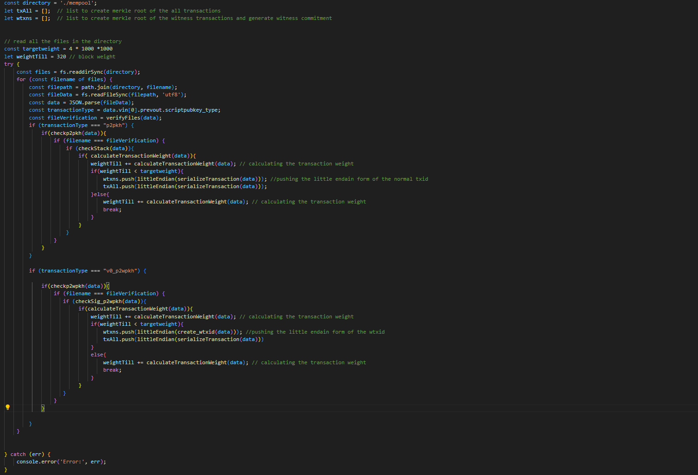

<h1>Summer of Bitcoin Code challenge </h1>

## Contents
- [Introduction](#Introduction)
- [CodeExplaination] (#code-explaination)
- [Resources]
- [Results](#Results)
- [Future Improvements](#ftimp)
- [Conclustion]

------------

## Introduction 

### Task
 Task is to simulate the mining process of a block, which includes validating and including transactions from a given set of transactions.The repository contains a folder `mempool` which contains JSON files.These files represent individual transactions, some of which may be invalid.Primary objective is to write a script that processes a series of transactions, validates them, and then mines them into a block. The output of your script should be a file named `output.txt` that follows a specific format.

--------------

### File Structure

---
## Code Explaination 
### Cryptographic and Common functions 
#### Cryptographic functions
- **SHA256**
sha256 uses buffer to convert the given data to bytes and then uses crypto library to create sha256 hash object.

- **doublehash**
double hash uses sha256 function internally twice to return the double sha256 of the given data.

- **ripemd160**
ripemd160 uses crypto library to return the ripemd160 object and returns the hexadecimal value of the returned object.

- **OP_HASH160**
OP_HASH160 uses sha256 and ripemd160 functions internally. It first gives sha256 of given data and then returns ripemd160 of that hash.

#### Common functions

- **tohex**
This toHex function converts a given value to its hexadecimal representation and ensures that the result has an even number of digits by padding with a leading zero if necessary.

- **littleEndian**
The littleEndian function reverses the byte order of the input data by splitting it into pairs of characters, reversing their order, and then joining them back together.

---

### Serialization 

#### Serialization of transactions
- **concVin**
`./functions/concVin`

    Concatenate the vin of all transactions:
    1. Initialize an empty string concatStr.
    2. For each vin in transaction.vin:
        - Convert the txid to `32 bytes little-endian` format in `hexadecimal` and append to concatStr.
        - Convert the vout to `4 bytes little-endian` format in `hexadecimal` and append to concatStr.
        - Calculate the size of scriptsig in bytes and convert it to a `1-byte hexadecimal` value, then append to concatStr.
        - Append the scriptsig to concatStr.
        - Convert the sequence to `4 bytes little-endian` format in `hexadecimal` and append to concatStr.
    3. Return concatStr.

- **concVout**
`./functions/concVout`

    Concatenate the vout of all transactions:
    1. Initialize an empty string concatStr.
    2. For each vout in transaction.vout:
        - Convert the value to `8 bytes little-endian` format in `hexadecimal` and append to concatStr.
        - Calculate the size of scriptpubkey in bytes and convert it to a `1-byte hexadecimal` value, then append to concatStr.
        - Append the scriptpubkey to concatStr.
    3. Return concatStr.

- **serializeTransaction**
`./functions/serializeTransaction`

    Serialize the transaction:
    1. Initialize an empty string concatStr.
    2. Convert the version to `4` bytes `little-endian format` in `hexadecimal` and append to concatStr.
    3. Convert the number of inputs to a `1-byte` `hexadecimal` value and append to concatStr.
    4. Call `concVin(transaction)` and append the result to concatStr.
    5. Convert the number of outputs to a `1-byte hexadecimal` value and append to concatStr.
    6. Call `concVout(transaction)` and append the result to concatStr.
    7. Convert the locktime to `4 bytes little-endian` format in `hexadecimal` and append to concatStr.
    8. Return the double hash of concatStr.

---

### File Verification
`./functions/verifyFiles`

    1. Serialize the transaction data using the serializeTransaction function.
    2. Convert the serialized data to little-endian format and assign it to data1.
    3. Convert data1 to a byte buffer dataBytes using hexadecimal encoding.
    4. Calculate the SHA-256 hash of dataBytes using the Node.js crypto module.
    5. Convert the hash value to hexadecimal string and append '.json' to the end.
    6. Return the resulting string.

---

### Transaction Validation
>Transaction is sent into a stack and based on the `OP_CODES` present in the transaction, stack is manipulated.
>When the stack gets the `OP_CHECKSIG` it undergoes transaction validation process.
>A transaction is valid if input in each transaction is valid.
>A message digest is created in association with each `vin` and using `public key and script signature` present in we validate the transaction using  `ECDSA verification` method.

### p2pkh verification

- **checkStack (stack implementation)**
`./functions/checkstack`

Function: checkStack(transaction)
Input: transaction - The transaction object to be checked

1. Initialize index to 0.
2. Iterate through each vin entry in the transaction:
     a. Initialize an empty stack.
     b. Split the scriptsig_asm of the current vin entry by spaces and store it in vin_asm.
     c. Push the second element of vin_asm onto the stack.
     d. Push the fourth element of vin_asm onto the stack.
     e. Split the scriptpubkey_asm of the current vin entry by spaces and store it in script.
     f. Iterate through each element in script:
          - If the element is 'OP_DUP':
               - Push the top element of the stack onto the stack.
          - If the element is 'OP_HASH160':
               - Pop the top element from the stack.
               - Calculate the RIPEMD160 hash of the SHA256 hash of the popped element and push it onto the stack.
          - If the element is 'OP_PUSHBYTES_20':
               - Push the next element in script onto the stack.
          - If the element is 'OP_EQUALVERIFY':
               - Pop the top two elements from the stack.
               - If they are not equal, return false.
          - If the element is 'OP_CHECKSIG':
               - Calculate the message digest of the transaction using createDigest function.
               - Pop the top element from the stack as the public key.
               - Pop the next top element from the stack as the signature.
               - Verify the ECDSA signature using verifyECDSASignature function.
3. Increment the index.
4. Return true.

- **createVindigest**
`./functions/createVindigest`

    1. Initialize an empty string concatStr.
    2. Iterate through each input (vin) of the transaction.
        If the current input index matches the specified index:
            Concatenate the transaction ID (txid), vout, scriptPubKey length, scriptPubKey, and sequence for the current input in little-endian format.
        Otherwise:
            Concatenate the transaction ID (txid), vout, "00" (placeholder for scriptPubKey length), and sequence for the current input in little-endian format.
    3. Return the concatenated string concatStr.

- **createDigest**
`./functions/createDigest`

    1. Concatenate the following components:
        * Version of the transaction in little-endian format.
        * Length of the vin (inputs) array in hexadecimal format.
        * Result of createVinDigest(transaction, index).
        * Length of the vout (outputs) array in hexadecimal format.
        * Result of concVout(transaction).
        * Locktime of the transaction in little-endian format.
        * Fixed value "01000000" (`sighhash`).
    2. Return the double hash of the concatenated string.

#### p2wpkh verification
- **hashPrevouts**
`./p2pwkh/hashPrevouts`

    1. Initialize an empty string concStr.
    2. Iterate over each entry vinEntry in transaction.vin.
    3. Convert vinEntry.vout to hexadecimal string voutString padded to 8 characters.
    4. Concatenate the little-endian representation of vinEntry.txid and voutString to concStr.
    5. Return the double hash of concStr.

- **hashSequences**
`./p2pwkh/hashSequences`

    1. Initialize an empty string concStr.
    2. Iterate over each entry vinEntry in transaction.vin.
    3. Convert vinEntry.sequence to hexadecimal string sequenceString padded to 8 characters.
    4. Concatenate the little-endian representation of sequenceString to concStr.
    5. Return the double hash of concStr.

- **outpoints**
`./p2pwkh/outpoints`

    1. Get the vinEntry at the specified index index from transaction.vin.
    2. Return the concatenation of the little-endian representation of vinEntry.txid and (vinEntry.vout).toString(16) padded to 8 characters.

- **scriptCode**
`./p2pwkh/scriptCode`

    1. Get the scriptpubkey from the prevout of the input at index inputIndex in transaction.vin.
    2. Concatenate the required script code elements and return.

- **amount**
`./p2pwkh/amount`

    1. Get the value from the prevout of the input at index index in transaction.vin.
    2. Convert it to a little-endian hexadecimal string padded to 16 characters and return.

- **nsequence**
`./p2pwkh/nsequence`

    1. Get the sequence from the input at index index in transaction.vin.
    2. Convert it to a little-endian hexadecimal string padded to 8 characters and return.

- **hashOutputs**
`./p2wpkh/hashOutputs`

    1. Initialize an empty string concBytes.
    2. Iterate over each entry voutEntry in transaction.vout.
    3. Concatenate little-endian representation of voutEntry.value as a hexadecimal string padded to 16 characters to concBytes.
    4. Convert (voutEntry.scriptpubkey.length / 2) to hexadecimal string padded to 2 characters and concatenate it to concBytes.
    5. Concatenate voutEntry.scriptpubkey to concBytes.
    6. Return the double hash of concBytes.

- **serializeP2WPKH**
`./p2wpkh/serializeP2WPKH`

    1. Concatenate the following data in little-endian byte order:
        * Transaction version (4 bytes)
        * Hash of all previous outputs (32 bytes)
        * Hash of all input sequence numbers (32 bytes)
        * Outpoint (previous transaction hash and index) for the specified index (36 bytes)
        * Script code for the specified input index (variable length)
        * Amount of the specified input index (8 bytes)
        * Sequence number of the specified input index (4 bytes)
        * Hash of all outputs (32 bytes)
        * Locktime of the transaction (4 bytes)
        * Transaction nLockTime (4 bytes) followed by a transaction version number (4 bytes) for Segregated Witness (SegWit) compatibility.
    2. Calculate the double SHA-256 hash of the concatenated data.
    3. Return the resulting hash value.

- **checkSig_p2wpkh**
`./p2wpkh/checkSig_p2wpkh`

    1. Iterate through each input (vin) of the transaction.
        * Serialize the transaction data for the current input using serializeP2WPKH(transaction, i).
        * Retrieve the public key and signature from the witness data of the current input.
        * Verify the ECDSA signature using verifyECDSASignature(pubkey, sig, serialization).
            * If the signature verification fails, return false.
    2. If all signature verifications pass for each input, return true.

---
### Weight Calculation
**Transaction Weight**
Transaction weight is a measure of the impact a transaction has on the size of a block in the blockchain. In Bitcoin, each transaction has a weight associated with it, which is calculated based on various factors such as the number of inputs and outputs, witness data (if SegWit is used), and other transaction details. The weight of a transaction determines how much space it occupies within a block.
` tx_weight = tx_weight * 4 + segwit_wt`

**Block Weight**
Block weight refers to the total weight of all transactions included in a block, as well as the block header itself. In traditional Bitcoin blocks (before SegWit), the block size limit was measured in megabytes (MB). However, with the introduction of SegWit, the concept of block weight was introduced to replace the traditional block size limit.The block weight limit is currently 4 million weight units (WU) for most Bitcoin blocks. The weight of each transaction contributes to the total block weight, and miners prioritize transactions based on their weight and associated fees.Block weight is fixed to be `300` units.

    1. Initialize variables tx_weight and segwit_wt to zero.
    2. Determine the type of transaction (tx_type) based on the presence of witness data.
    3. Add 4 bytes for the version field to tx_weight.
    4. If the number of inputs exceeds 50, return false.
    5. Add 1 byte for the input count to tx_weight.
    6. For each input in tx.vin:
        * Add 32 bytes for the transaction ID (txid) and 4 bytes for the vout to tx_weight.
        * Convert the scriptSig to a buffer and calculate its length in bytes, then add 1 byte for the length and the scriptSig length to tx_weight.
        * Add 4 bytes for the sequence number to tx_weight.
    7. If the number of outputs exceeds 50, return false.
    8. Add 1 byte for the output count to tx_weight.
    9. For each output in tx.vout:
        * Add 8 bytes for the value and 1 byte for the scriptPubKey length, then calculate the length of the scriptPubKey in bytes and add it to tx_weight.
    10. Add 4 bytes for the locktime to tx_weight.
    11. If the transaction type is "SEGWIT":
        * Add 2 bytes for the marker and flag fields to segwit_wt.
        * For each input in tx.vin, iterate through the witness data:
            * Convert the witness item to a buffer and calculate its length in bytes, then add 1 byte for the length and the witness item length to segwit_wt.
    12. Calculate the total weight of the transaction: tx_weight * 4 + segwit_wt.
    13. Return the calculated transaction weight.

---
### Witness Transaction id

***Witness transactin ids are the txids of `Segwit` transactions, we use these transaction ids to generate witness merkle root with which we create `witness commitment`.

- **create_wtxid**
`./wtxid/create_wtxid`

    - Input: `tx` (transaction object)
    - Output: `wtxid` (transaction identifier)
    - Steps:
        1. Convert `tx.version` to a hexadecimal string representation (`version_hex`).
        2. Pad `version_hex` to 8 characters with leading zeros.
        3. Concatenate `version_hex` with `'00'` (marker) and `'01'` (flag).
        4. Convert the length of `tx.vin` to a hexadecimal string representation (`vin_length_hex`).
        5. Pad `vin_length_hex` to 2 characters with leading zeros.
        6. Concatenate `vin_length_hex` with the concatenated inputs (`concVin(tx)`).
        7. Convert the length of `tx.vout` to a hexadecimal string representation (`vout_length_hex`).
        8. Pad `vout_length_hex` to 2 characters with leading zeros.
        9. Concatenate `vout_length_hex` with the concatenated outputs (`concVout(tx)`).
        10. Concatenate the witness data (`conc_witness(tx)`).
        11. Convert `tx.locktime` to a hexadecimal string representation (`locktime_hex`).
        12. Pad `locktime_hex` to 8 characters with leading zeros.
        13. Convert the concatenated string to little endian format.
        14. Return the double hash of the little endian string as the `wtxid`.

- **conc_witness**
`./wtxid/conc_witness`

    - Input: `tx` (transaction object)
    - Output: `concstr` (concatenated witness data)
    - Steps:
        1. Initialize an empty string `concstr`.
        2. Iterate through each entry (`vinEntry`) in `tx.vin`.
        3. Check if the `witness` property is defined for the current `vinEntry`.
        4. If `witness` is defined, iterate through each `wit` in `witness`.
        5. For each `wit`, calculate its length in hexadecimal (`wit_length_hex`).
        6. Pad `wit_length_hex` to 2 characters with leading zeros.
        7. Concatenate `wit_length_hex` with `wit`.
        8. Append the concatenated string to `concstr`.
        9. Return `concstr` containing the concatenated witness data.

---

### Witness commitment

**Merkle root**
The Merkle root is like a summary or fingerprint of all the transactions in a block in a blockchain. It's computed by repeatedly hashing pairs of transaction IDs until there's only one hash left, which becomes the Merkle root. This root is then stored in the block header. If any transaction in the block changes, the Merkle root will change, ensuring the integrity of the entire block.
- Think of a Merkle tree as a way to efficiently summarize a large amount of data. In the context of cryptocurrencies like Bitcoin, a Merkle tree is used to store and organize transaction data efficiently.

- **generateMerkleRoot**
`./coinbase/generateMerkleRoot`

 - Input: `txids` (an array of transaction IDs)
   - Output: `merkleRoot` (the Merkle root)
   - Steps:
     1. If the length of `txids` is 0, return null.
     2. Create a new array `level` by mapping each transaction ID (`txid`) in `txids` to a Buffer created from its little endian representation.
     3. Repeat the following steps while the length of `level` is greater than 1:
        - Create an empty array `nextLevel`.
        - Iterate through `level` in pairs:
          - If the index `i` is the last element of `level`, duplicate the last element to make a pair.
          - Calculate the double hash of the concatenation of the pair of Buffers.
          - Add the resulting hash to `nextLevel` as a Buffer.
        - Set `level` to `nextLevel`.
     4. Return the hexadecimal string representation of the first element of `level`, which represents the Merkle root.

**Witness Commitment**
A Witness Commitment is a cryptographic mechanism used in blockchain systems to embed additional data, typically related to transaction witnesses (such as signatures or scripts), directly into the block header. This ensures the integrity and authenticity of the transaction data while allowing for compact representation and efficient verification. In simpler terms, it's like adding a digital fingerprint to the block header, ensuring that transaction data can be securely linked to the block without bloating the block size.

**Witness Reserve**
Witness Reserve refers to a section within a blockchain transaction that stores additional data required for certain types of transactions, particularly those involving advanced features like Segregated Witness (SegWit). In Bitcoin and some other cryptocurrencies, the Witness Reserve holds witness data, which includes signatures and other authentication information. This separate area allows for improved scalability and efficiency by segregating witness data from transaction inputs, enabling more transactions to be included in each block.
- In bitcoin witness reserve is `64-bit "0"` String.

- **generate_witness_commitment**

- Witness commitment is double hash of merkle root of all the wtxids of `Segwit transactions` (only) with `Witness Reserve` value.

---

### Coinbase Transaction
A coinbase transaction is the first transaction in a block.It's placed there by the miner when they construct their candidate block so they can claim the block reward (block subsidy + fees) if they are successful in mining the block.It's a special type of transaction that has a single blank input. So in other words, the outputs from coinbase transactions are the source of new bitcoins.
- Coinbase transaction is different for every miner, because one of the output of coinbase transaction contains the witness commitment in added with value `6a24aa21a9ed`.

    - Input: `wtxns` (an array of witness transactions)
    - Output: `coinbase_tx` (the generated coinbase transaction)
    - Steps:
        1. Prepend a string of 64 zeros to the `wtxns` array.
        2. Log the modified `wtxns` array.
        3. Generate the Merkle root (`wmkrlrt`) of the modified `wtxns` array using the `generateMerkleRoot` function.
        4. Log the Merkle root.
        5. Generate the witness commitment (`witness_commitment`) using the `generate_witness_commitment` function with the Merkle root.
        6. Log the witness commitment.
        7. Concatenate the witness commitment with the prefix `'6a24aa21a9ed'` and convert it to a hexadecimal string (`scriptpubkey`).
        8. Set the `scriptsig` to `"49366144657669436872616E496C6F7665426974636F696E4D696E696E67"`.
        9. Initialize an empty string `coinbase_tx`.
        10. Append `"01000000"` (version) to `coinbase_tx`.
        11. Append `"0001"` (marker + flag) to `coinbase_tx`.
        12. Append `"01"` (number of inputs) to `coinbase_tx`.
        13. Append a string of 64 zeros (representing the previous output) to `coinbase_tx`.
        14. Append `"ffffffff"` (sequence) to `coinbase_tx`.
        15. Append `"25246920616d206e61726173696d686120616e64206920616d20736f6c76696e672062697463"` (coinbase scriptSig) to `coinbase_tx`.
        16. Append `"ffffffff"` (sequence) to `coinbase_tx`.
        17. Append `"02"` (number of outputs) to `coinbase_tx`.
        18. Append the first output:
            - Append `"f595814000000000"` (value - 1) to `coinbase_tx`.
            - Append `"19"` (size of scriptpubkey) to `coinbase_tx`.
            - Append `"76a914edf10a7fac6b32e24daa5305c723f3de58db1bc888ac"` (scriptpubkey) to `coinbase_tx`.
        19. Append the second output:
            - Append `"0000000000000000"` (value - 2) to `coinbase_tx`.
            - Append the length of `scriptpubkey` as a hexadecimal string with leading zero padding to `coinbase_tx`.
            - Append `scriptpubkey` to `coinbase_tx`.
        20. Append `"01"` (number of witnesses) to `coinbase_tx`.
        21. Append `"20"` (size of witness commitment) to `coinbase_tx`.
        22. Append a string of 64 zeros (representing the witness commitment) to `coinbase_tx`.
        23. Append `"00000000"` (locktime) to `coinbase_tx`.
        24. Return `coinbase_tx`.

---
# Work Flow 

1. **Reading Files in the Directory**:
   - Iterate through each file in the specified directory.
   - Read the content of each file synchronously.
   - Parse the JSON data from each file.

2. **Transaction Type Verification**:
   - Check the transaction type (`transactionType`) extracted from the parsed JSON data.
   - Separate transactions based on their types (`p2pkh` and `v0_p2wpkh`).

3. **Transaction Verification and Weight Calculation**:
   - Verify each transaction file to ensure its integrity using `verifyFiles(data)`.
   - For `p2pkh` transactions:
     - Check if it's a valid `p2pkh` transaction using `checkp2pkh(data)`,i.e, checking whether all the inputs present in the transaction are p2pkh only.
     - Verify the stack within the transaction using `checkStack(data)`,i.e, stack implementation to verify and validate the transaction.
     - Calculate the weight of the transaction using `calculateTransactionWeight(data)`.
     - If the total weight is less than the target weight, push the little-endian form of the serialized transaction (`serializeTransaction(data)`) into the `wtxns` array and also into the `txAll` array.
   - For `v0_p2wpkh` transactions:
     - Check if it's a valid `v0_p2wpkh` transaction using `checkp2wpkh(data)`,i.e, checking whether all the inputs present in the transaction are p2wpkh only.
     - Verify the signature within the transaction using `checkSig_p2wpkh(data)`,i.e, generating message digest and verifying that using `ECDSA verification`.
     - Calculate the weight of the transaction using `calculateTransactionWeight(data)`.
     - If the total weight is less than the target weight (4000000) , push the little-endian form of the `wtxid` generated by `create_wtxid(data)` into the `wtxns` array and also into the `txAll` array.

4. **Generating Coinbase Transaction**:
   - Generate the coinbase transaction using `generate_coinbase_tx(wtxns)` function.
   - Prepend the double hash of the coinbase transaction (in little-endian format) to the `txAll` array.

5. **Generating Merkle Root**:
   - Generate the Merkle root of all transactions (`txAll`) using `generateMerkleRoot(txAll)` function.

6. **Final Output**:
   - The Merkle root (`merkleroot`) is obtained, which represents the root of the Merkle tree constructed from all transactions, including the coinbase transaction.

This workflow ensures the verification, integrity, and construction of the Merkle tree from the transactions present in the specified directory.

----

## Generating block
A block is a container for transactions.At the top of every block is a block header, which summarizes all of the data inside in the block. This contains a fingerprint (merkle root) of all the transactions in the block, as well as a reference to a previous block.Miners repeatedly hash this block header to try and get a result below the current target. If you can get a block hash below the target, the block can be added on to the blockchain. This process is called mining.

### Block header
- **generate_block**
`./block/generate_block`

1. Get the current timestamp in seconds.
2. Define a function to generate the block header:
   a. Initialize an empty string to store the block header.
   b. Append the version of the block to the block header.
   c. Append the hash of the previous block (all zeros) to the block header.
   d. Append the Merkle root to the block header.
   e. Append the little-endian representation of the current timestamp to the block header.
   f. Append the bits field to the block header.

### Mining
Mining is the process of trying to add a new block of transactions on to the blockchain.It's a network-wide competition where any node on the network can work to try and add the next block on to the chain.When a new block is mined, it gets broadcast across the network, where each node independently verifies and adds it on to their blockchain.After adding the new block, each mining node restarts the process to try to build on top of this new block in the chain. As a result, the blockchain is regularly updated thanks to a collaborative effort of nodes across the network.
- We construct a block header for this candidate block. This is basically a short summary of all of the data inside the block, which includes a reference to an existing block in the blockchain that we want to build on top of.
- We include block header, coin base transaction and all the txids generated by serialization of transactions.

#### Proof of Work 
- The term "proof of work" just refers to the fact that it takes work to get a block hash below the target. And if you can, anyone else can check that work has been done by confirming that the hash for the block you have constructed is indeed below the target.In other words, the hash function is used as a way to prove that you have performed a required amount of "work" on your block.
- Basically we add 4 byte value called `nonce` to the block header, double hash the block and then verify the hexadecimal value of the hash generated is less than target.
- We try to get the hash value less than target and if we reached the values less than target, our block is mined.

#### Target Value
- Target value given in assaignement is "0000ffff00000000000000000000000000000000000000000000000000000000".

- **mine**
`./mine/mine`

   - Input: `block_header` (the header of the block to be mined)
   - Output: `mined_block` (the mined block)
   - Steps:
     1. Define the target hash as a buffer obtained from the hexadecimal string `"0000ffff00000000000000000000000000000000000000000000000000000000"`.
     2. Initialize the nonce to 0.
     3. Convert the nonce to a hexadecimal string and pad it with leading zeros to make it 4 bytes (`paddedNonce`).
     4. Enter an infinite loop:
        a. Concatenate the `block_header` with the `paddedNonce`.
        b. Calculate the double hash of the concatenated string in little-endian format.
        c. Convert the resulting hash to a buffer.
        d. Compare the target hash with the calculated hash:
           - If the calculated hash is less than the target hash, indicating success in mining:
             - Log the padded nonce.
             - Return the concatenated string (`block_header` + `paddedNonce`) as the mined block.
        e. Increment the nonce.
        f. Update the `paddedNonce` with the new nonce value padded with leading zeros.

---        

## Resources
### Overview of Bitcoin Network and Blockchain Security
- **Source**: [Rosenbaum Book](https://rosenbaum.se/book/)
- **Description**: The Rosenbaum Book provided an in-depth exploration of the Bitcoin network and blockchain security. It covered essential topics such as the significance of Bitcoin, the intricacies of private keys, public keys, and seeds, and the pivotal role of wallets in securing digital assets. This resource also shed light on Bitcoin nodes and their functions within the network architecture.

### Understanding Bitcoin Transactions and Mining Processes
- **Source**: [Learn Me a Bitcoin](https://learnmeabitcoin.com/)
- **Description**: Learn Me a Bitcoin served as an invaluable resource for comprehending the intricacies of Bitcoin transactions and mining operations. With clear explanations and practical examples, this resource elucidated the workflow of Bitcoin transactions, including the calculation of Merkle roots. Additionally, it offered insightful code blocks that facilitated the implementation and verification of various components, enhancing the understanding and coding proficiency of Bitcoin-related tasks.

### Bitcoin Improvement Proposal (BIP) Documentation
- **Source**: [BIP-0143](https://github.com/bitcoin/bips/blob/master/bip-0143.mediawiki)
- **Description**: BIP-0143 documentation provided comprehensive insights into Bitcoin Improvement Proposals (BIPs), particularly focusing on the creation and verification processes of message digests for different transaction types such as p2wpkh, p2sh, and p2wsh. Through detailed explanations and technical specifications, this resource enriched the understanding of message digest mechanisms and their significance in the Bitcoin protocol.

### Community Support
- **Source**: Summer of Bitcoin Discord Channel
- **Description**: Engaging with the vibrant community of Bitcoin enthusiasts in the Summer of Bitcoin Discord channel proved instrumental in navigating through challenges and seeking assistance. Interacting with peers, sharing knowledge, and participating in discussions facilitated the resolution of queries and provided valuable insights into Bitcoin-related concepts, implementation nuances, and best practices. The collaborative environment fostered learning and contributed significantly to the overall project development process.

---

## Results
### Grading Outcome
- **Marks Obtained**: 76 out of 100
- **Description**: The project was evaluated using a grading system, where a total of 100 marks were assigned based on various criteria such as code quality, adherence to specifications, clarity of explanations, and overall effectiveness in achieving the project objectives. The achieved score of 76 reflects a commendable performance, indicating a successful completion of the project tasks and meeting the expected standards. This outcome demonstrates a strong understanding of Bitcoin concepts and effective implementation skills in simulating the mining process and validating transactions.

--- 

## Future Improvements
- Currently the code works only for `p2pkh` and `p2wpkh` only.
- Code can be scaled to support `p2sh`,`p2wsh` and `p2tr` transactions also.
- Code organization and structuring can be improved.

---

## Conclusion
